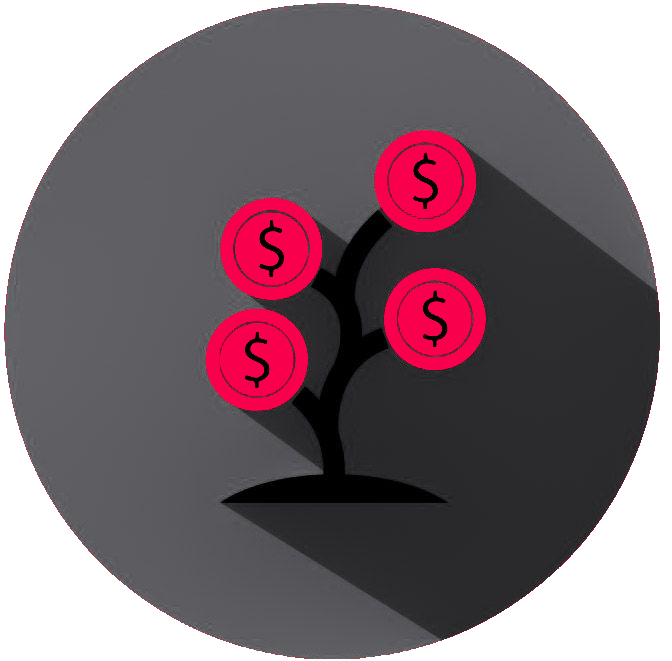
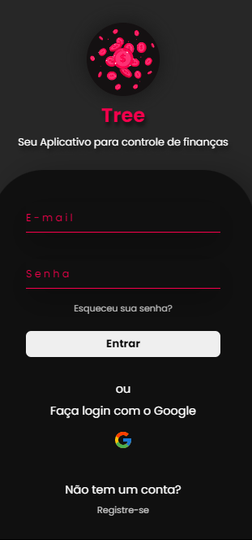
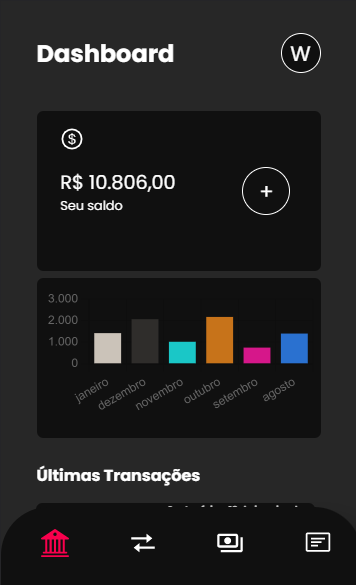
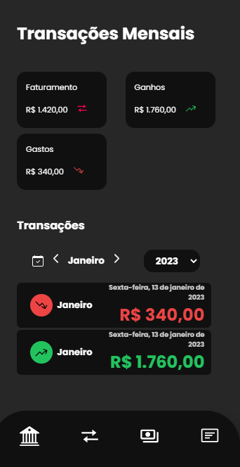
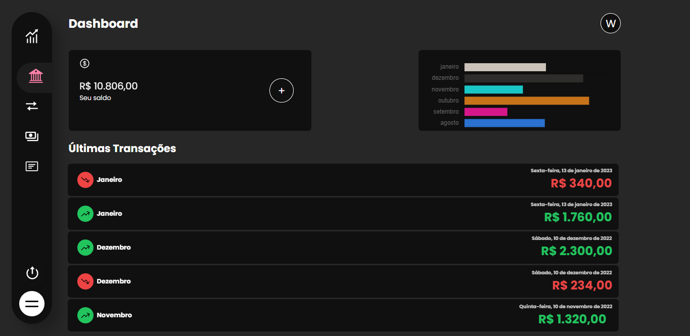
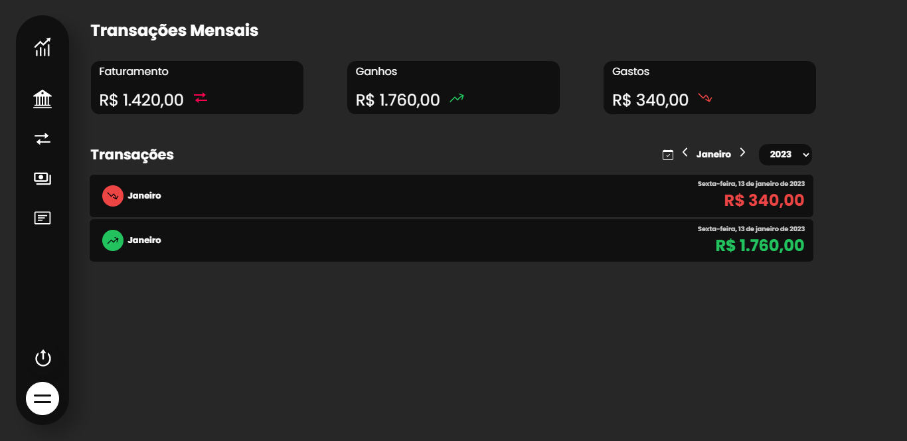
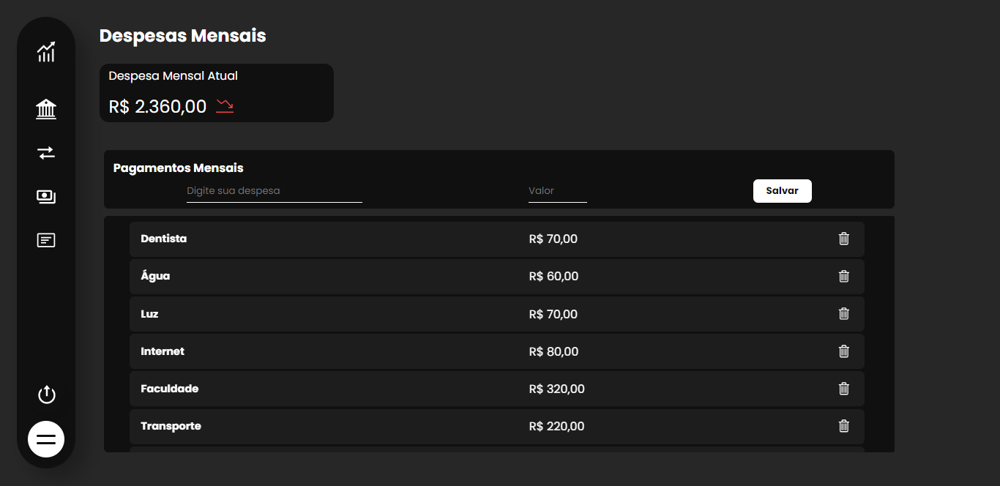
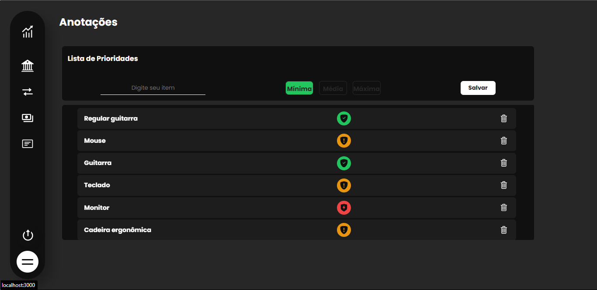
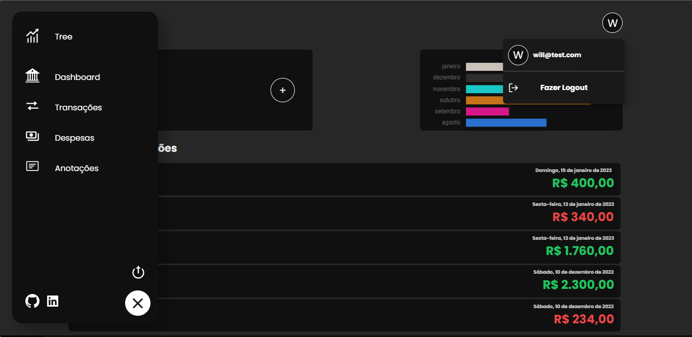

<!-- 

 -->

<!-- #### Há algum tempo estava querendo criar meu próprio aplicativo de finanças, a ideia era suprir apenas minhas necessidades, já que mantenho minhas anotações salvas no Excel, porém, queria algo mais dinâmico onde eu poderia registrar minhas despesas de onde eu quisesse, depois de estudar bastante consegui aplicar meus conhecimentos. Nesse App é possível registrar quantas despesas vocês desejarem de forma segura dentro da sua própria conta! Você pode fazer um registro no aplicativo ou logar com sua conta Google. O App traz uma lista de todas as suas finanças, onde você pode filtrar por mês e ano obtendo os valores de ganhos, gastos e faturamentos. Ele ainda possui uma visualização dos faturamentos dos últimos 6 meses e campos para deixar suas anotações que costumam ser despesas mensais e uma lista de prioridades, para ajudar você seguir a sua meta. -->

#

<h1>Tree    

Aplicativo para controle de fincanças

</h1>

## Descrição

[Ver Projeto](https://tree-app-renovatt.vercel.app) 💰

#### Desenvolvi um aplicativo de finanças para atender minhas necessidades pessoais. Ele permite registrar despesas de forma segura e acessí-las de qualquer lugar, além de oferecer filtragem por mês e ano, visualização de faturamentos dos últimos 6 meses, campos para anotações e lista de prioridades. Estou cada vez mais feliz pelo meu progresso e por hora, este é o resultado do projeto, quem sabe mais aplicações podem surgir no futuro.

#

## _Layout Mobile_

  
#
 
#

## _Layout Web_

#

#

#

#

#

## 💻 Tecnologias

🛠️ **Construção do site**
- [React](https://create-react-app.dev/)
- [React Router](https://reactrouter.com/)
- [Chart.js](https://www.chartjs.org)
- [Node e NPM](https://nodejs.org/)
- [AwesomeApi](https://docs.awesomeapi.com.br/)

📁 **Banco de Dados**
- [Firebase](https://firebase.google.com/?hl=pt)
- [Firebase Authentication](https://firebase.google.com/docs/auth)
- [Firebase Firestorage](https://firebase.google.com/docs/firestore)

🎨 **Estilização**
- [Styled-Components](https://styled-components.com/)

🔋 **Versionamento e Deploy**
- [Git](https://git-scm.com)
- [Vercel](https://vercel.com/)

 

⚙️ **Configuranções e Instalações**

Clone do Projeto

    $ git clone https://github.com/renovatt/tree-app.git

Instalando as Dependências

    $ npm install

Iniciando o Projeto

    $ npm start

 

**Como contribuir?**
##### Você pode dar suporte me seguindo aqui no GitHub, dando uma estrela no projeto ou criar uma conexão comigo no linkedin, fazendo parte da minha Networking e curtir o meu projeto.

 

**Autor**
[*Wildemberg Renovato de Lima*](https://www.linkedin.com/in/renovatt/)